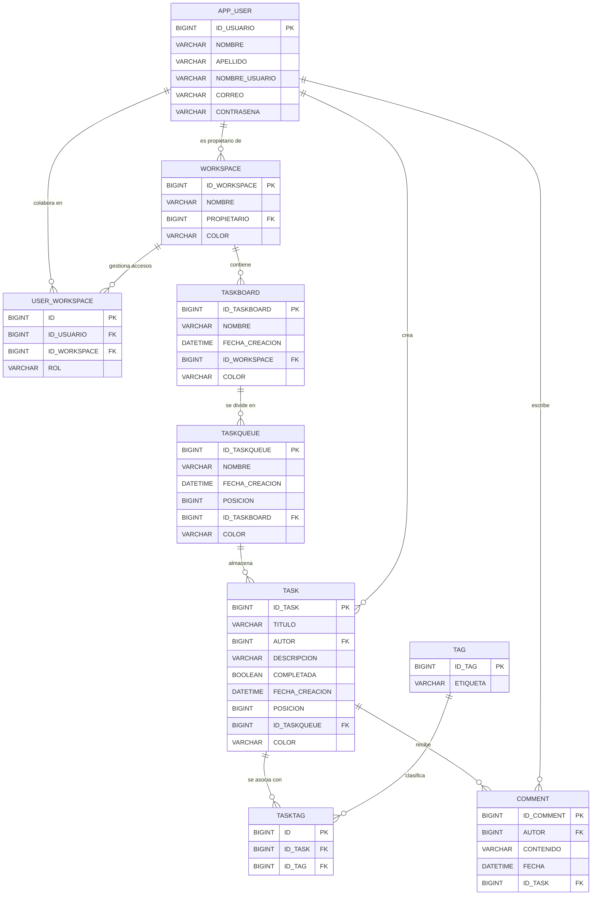

<div align="center">

# 🚀 Work In Progress (WIP)
**El gestor de proyectos que va al grano. Sin ruido, sin fricción, solo progreso.**

[](#)
[](#)
[](https://spring.io/)
[](#)
[](#)

</div>

---

## 📖 Sobre el Proyecto

**Work In Progress (WIP)** es una plataforma SaaS (Software as a Service) orientada a la gestión de proyectos y tareas para equipos pequeños y medianos. Nace con una filosofía clara: **eliminar la parafernalia**. 

A diferencia de otras herramientas del mercado que saturan al usuario con opciones redundantes, WIP ofrece un flujo de trabajo minimalista, de alto contraste visual y directo. Inspirado en los principios de la comunicación audiovisual, cada color, animación y componente en WIP tiene una intención semiótica clara, ayudando al usuario a concentrarse exclusivamente en avanzar.

Además, WIP es un proyecto **Open-Source**. Creemos en el código abierto para que la comunidad audite, mejore y adapte la herramienta a las necesidades de cualquier equipo ágil.

<div align="center">
  <i>"El progreso no se mide por lo que terminas, sino por lo que construyes cada día."</i>
</div>

---

## ✨ Características Principales

* 📱 **Progressive Web App (PWA):** WIP es instalable en dispositivos móviles y de escritorio. Funciona de manera nativa e inmersiva sin consumir espacio de almacenamiento masivo.
* ⚡ **Optimistic UI:** La interfaz responde en 0 milisegundos. Actualizamos el estado local (como cambios de color, marcadores o movimientos de tareas) antes de recibir la confirmación del servidor, logrando una fluidez absoluta.
* 🖱️ **Drag & Drop Avanzado:** Sistema de tableros Kanban interactivos y orgánicos impulsados por `@hello-pangea/dnd`.
* 🎨 **Jerarquía Cromática:** Sistema de diseño basado en fondos pastel para descansar la vista y colores vibrantes en elementos interactivos para guiar la atención del usuario.
* 🛡️ **Validaciones Front-End Estrictas:** Feedback visual en tiempo real y validación por expresiones regulares (Regex) de campos sensibles y contraseñas antes de contactar al servidor, mejorando la seguridad y la UX.

---

## 🛠️ Stack Tecnológico

### Frontend
* **React + TypeScript:** Arquitectura SPA fuertemente tipada.
* **Zustand:** Gestión de estado global ligera y eficiente.
* **Axios:** Cliente HTTP centralizado y configurado.
* **Lucide React:** Iconografía vectorial consistente y dinámica.

### Backend & Base de Datos
* **Java + Spring Boot:** API RESTful robusta y escalable.
* **MySQL:** Base de datos relacional para garantizar la integridad referencial.

---

## 🗄️ Arquitectura de Datos

La base de datos sigue una estructura fuertemente normalizada para asegurar la jerarquía de los espacios de trabajo. 



---

## ⚙️ Instalación y Configuración

### Prerrequisitos
Asegúrate de tener instalado en tu sistema:
* **Node.js** (v18 o superior).
* **pnpm** (Gestor de paquetes recomendado).
* **Java 17** (o superior) & **Maven**.
* **MySQL** (v8 o superior).

> 💡 **¿Por qué `pnpm`?** Utilizamos `pnpm` en lugar de `npm` o `yarn` debido a su enfoque estricto en la resolución de dependencias mediante *symlinks*. Esto evita el problema de las "dependencias fantasma" (*phantom dependencies*), dándole al proyecto una capa vital de seguridad adicional, mayor estabilidad en entornos de producción y una velocidad de instalación drásticamente superior.

### 1. Clonar el repositorio
```bash
git clone [https://github.com/tu-usuario/work-in-progress.git](https://github.com/tu-usuario/work-in-progress.git)
cd work-in-progress
```

### 2. Configurar la Base de Datos
1. Inicia sesión en tu servidor local de MySQL.
2. Copia y ejecuta el script de inicialización detallado arriba para estructurar el esquema `Work_In_Progress`.
3. Dirígete al directorio del backend y configura las credenciales de tu base de datos (`spring.datasource.username` y `spring.datasource.password`) en el archivo `src/main/resources/application.properties`.

### 3. Ejecutar el Servidor Backend (Spring Boot)
```bash
cd backend
./mvnw spring-boot:run
````

*El núcleo de la API REST se levantará de forma predeterminada en http://localhost:8080.*

### 4. Desplegar el Entorno Frontend
Abre una terminal independiente en la raíz del proyecto y ejecuta:

```bash
cd frontend
pnpm install
pnpm dev
```

*Vite compilará el entorno de desarrollo y lo servirá de manera inmediata en http://localhost:5173.*

---

## 🛡️ Capa de Validaciones en el Front-End

Para no saturar innecesariamente al servidor y brindar una UX fluida, la capa de cliente de WIP procesa de forma rigurosa las entradas antes de realizar operaciones de red:

* **Validación de Formularios mediante Expresiones Regulares (Regex):** El registro y login auditan cadenas complejas para verificar la estructura del correo electrónico, la longitud y robustez de contraseñas, y la ausencia de caracteres especiales peligrosos.
* **Bloqueo Pragmático de Peticiones:** Los botones de acción se deshabilitan o interceptan inmediatamente si los campos requeridos no cumplen las políticas mínimas de longitud o sanitización, ahorrando ancho de banda y reduciendo la carga computacional en el backend.
* **Control de Nulidad Dinámico:** Tareas, listas y nombres de workspaces se limpian de espacios en blanco mediante métodos de truncado (`.trim()`) antes de enviarse, evitando el almacenamiento de registros vacíos u orfanatos de datos.

---

## 👨‍💻 Autor

**Francisco Jesús del Olmo**
*Desarrollador Web & Realizador Audiovisual*

Fusionando la estructura rigurosa y matemática de la ingeniería de software con la semiótica y sensibilidad estética de la narrativa audiovisual, con el fin de concebir herramientas de software que no solo operen de forma impecable, sino que comuniquen, inspiren y fluyan de manera orgánica con las personas.